# 🎰 CSGMVE: Comprehensive Slot Game Mathematical Modeling & Validation Engine

[](https://www.python.org/)
[](https://streamlit.io)
[]()

> **Live Demo:** [https://slot-game-math.streamlit.app/](https://slot-game-math.streamlit.app/)

---

## 📖 Introduction

**CSGMVE** is a production-grade mathematical engine designed to simulate, analyze, and validate casino slot machine logic. Unlike simple random generators, this engine implements **reel-strip mechanics**, **payline geometry**, and **combinatorial probability** to calculate the theoretical "Return to Player" (RTP) and Volatility.

It features a dual-verification system:
1.  **Theoretical Engine**: Calculates exact probabilities using combinatorics ($O(N^5)$ complexity).
2.  **Monte Carlo Engine**: Validates the theory by simulating millions of spins (Law of Large Numbers).

---

## 🏗️ System Architecture

The following diagram illustrates the data flow from configuration to visualization.

```mermaid
graph TD
    subgraph INPUT ["🔌 Input Layer"]
        JSON[("Configuration JSON<br>(Reels, Paylines, Weights)")]
    end

    subgraph CORE ["🧠 Core Mathematical Engine"]
        ReelStrip["Reel Strip Logic<br>(Weighted Arrays)"]
        Payline["Payline Evaluator<br>(Geometry & Wilds)"]
        RTP["Combinatorial Calculator<br>(Exact Math)"]
        Bonus["Bonus Math Module<br>(Markov Chains/Binomial)"]
    end

    subgraph SIM ["🎲 Simulation Layer"]
        MonteCarlo["Monte Carlo Simulator<br>(Mersenne Twister RNG)"]
        Batch["Batch Processor<br>(100k chunks)"]
    end

    subgraph DATA ["💾 Data Persistence"]
        SQLite[("SQLite Database<br>(Raw Spin Data)")]
        JSON_Export[("Lightweight Dashboard JSON<br>(Deployment Data)")]
    end

    subgraph ANALYSIS ["📈 Analysis Layer"]
        VolAnalyzer["Volatility Analyzer"]
        Risk["Risk of Ruin Calc"]
        Convergence["Convergence Tracker"]
    end

    subgraph OUTPUT ["🖥️ Presentation Layer"]
        Dashboard["Streamlit Dashboard<br>(Interactive UI)"]
        PAR["PAR Sheet Generator<br>(Regulatory Excel)"]
    end

    %% Data Flow Connections
    JSON --> ReelStrip
    ReelStrip --> Payline
    Payline --> RTP
    ReelStrip --> MonteCarlo
    Payline --> MonteCarlo
    
    RTP --> PAR
    
    MonteCarlo --> Batch --> SQLite
    
    SQLite --> VolAnalyzer
    VolAnalyzer --> Risk
    VolAnalyzer --> Convergence
    
    SQLite --> JSON_Export
    JSON_Export --> Dashboard
    
    style INPUT fill:#f9f,stroke:#333,stroke-width:2px
    style CORE fill:#bbf,stroke:#333,stroke-width:2px
    style SIM fill:#bfb,stroke:#333,stroke-width:2px
    style DATA fill:#ff9,stroke:#333,stroke-width:2px
    style OUTPUT fill:#f96,stroke:#333,stroke-width:2px
```



---

## 🧩 Component Deep Dive

### 1. Core Mathematics (`/core`)
The brain of the system. It does not "guess"; it calculates.
*   **`ReelStrip`**: Handles virtual reel mapping. It converts `virtual_reel_stops` (e.g., 64 positions) into weighted probabilities, allowing for precise control over symbol frequency (e.g., a "Near Miss" effect).
*   **`PaylineEvaluator`**: Supports complex geometry. Unlike simple slots that check row 2, this evaluator handles V-shapes, Zig-zags, and Inverted-V patterns across a 5x3 grid. It recursively handles **Wild Substitutions**.

### 2. Monte Carlo Engine (`/simulation`)
To prove the math holds up in the real world, this engine simulates gameplay at scale.
*   **Performance**: Capable of executing **10,000,000 spins** in minutes using batch processing to minimize memory overhead.
*   **RNG**: Uses a cryptographically secure seeding mechanism for reproducibility.
*   **Storage**: Dumps raw telemetry (Win Amount, Symbols, Triggers) into SQLite for post-mortem analysis.

### 3. Volatility Analyzer (`/analysis`)
It's not enough to know *if* a player wins; we must know *how* they win.
*   **Standard Deviation**: Calculates the variance of the game. High variance = High Risk/High Reward.
*   **Risk of Ruin**: Uses the Gambler's Ruin formula to predict the probability of a player going bankrupt based on their starting bankroll.
*   **Confidence Intervals**: Calculates the 95% Confidence Interval (CI) to determine if the simulation has converged to the theoretical RTP.

### 4. Visualization (`/dashboard`)
A **Streamlit** application acting as the frontend.
*   **Live Play**: Allows manual testing with visual feedback.
*   **Convergence Plot**: Visualizes the "Law of Large Numbers" in action as the RTP stabilizes.
*   **Distribution Histograms**: Plots win sizes to ensure the "Hit Frequency" feels right.

---

## 📂 Project Structure

```bash
slot_math_engine/
├── analysis/           # Statistical analysis modules (Volatility, Risk)
├── core/               # Core game logic (Math, Reels, Paylines)
├── dashboard/          # Streamlit Web App
│   └── app.py          # Dashboard entry point
├── data/
│   └── reel_configs/   # JSON Configuration files
├── images/             # Asset resources (Joker, Diamond)
├── reporting/          # Excel PAR Sheet generation
├── simulation/         # Monte Carlo engine & Database
├── main.py             # CLI Entry Point
└── requirements.txt    # Dependencies
```

---

## 🚀 Installation & Usage

### 1. Setup
```bash
git clone https://github.com/yourusername/csgmve.git
cd csgmve
pip install -r slot_math_engine/requirements.txt
```

### 2. Analyze Theoretical Math
Check the exact mathematical properties of your configuration:
```bash
python slot_math_engine/main.py analyze
```

### 3. Run Simulation
Generate 1,000,000 spins to validate the math:
```bash
python slot_math_engine/main.py simulate --spins 1000000
```

### 4. Launch Dashboard
Visualize the results in your browser:
```bash
python slot_math_engine/main.py dashboard
```

---

## 📊 Performance Metrics

The engine was benchmarked using the "Production v8" configuration.

| Metric | Value | Description |
| :--- | :--- | :--- |
| **Total Spins** | 5,000,000 | Simulation sample size |
| **Theoretical RTP** | 94.80% | Exact combinatorial calculation |
| **Simulated RTP** | 95.43% | Actual return over 5M spins |
| **Delta** | +0.63% | Within acceptable variance for high volatility |
| **Hit Frequency** | 47.24% | Probability of any win per spin |
| **Standard Dev** | 66.19 | Extremely High Volatility profile |
| **Process Speed** | ~17,000 spins/sec | Single-core Python performance |

---

## ⚔️ Technical Challenges & Solutions

### 1. The Combinatorial Explosion
*   **Challenge**: A 5-reel slot with 64 stops has $64^5$ (1 Billion+) combinations. Iterating them all for exact math is slow.
*   **Solution**: Implemented **Monte Carlo Approximation** for rapid prototyping, reserving exact combinatorial calculation for the final verification step.

### 2. Memory Management
*   **Challenge**: Storing 5 million spin objects in RAM causes crashes.
*   **Solution**: Implemented **Batch Processing** with SQLite transactions. The engine processes spins in chunks of 100,000, flushes to disk, and clears RAM, keeping the footprint minimal (<500MB).

### 3. Deployment Constraints
*   **Challenge**: The simulation database is 2GB+, making it impossible to deploy to free cloud tiers.
*   **Solution**: Created a `export-web` pipeline that digests the heavy database into a lightweight **JSON artifacts** file (~50KB). The dashboard intelligently switches between "Live Database Mode" (local) and "Static Artifact Mode" (cloud).

---

